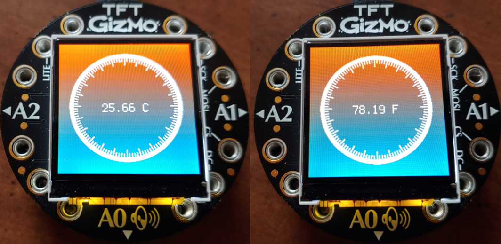

# Circuit Playground + TFT Gizmo Thermometer Example

This example shows how to use your TFT Gizmo + Circuit Playground Express, or Circuit Playground Bluefruit to display the current tempterature on top of a bitmap background. 

**Requiremenets:**
* [Adafruit_CircuitPython_Gizmo](https://github.com/adafruit/Adafruit_CircuitPython_Gizmo)
* [Adafruit_CircuitPython_ST7789](https://github.com/adafruit/Adafruit_CircuitPython_ST7789)
* [Adafruit_CircuitPython_Display_Text](https://github.com/adafruit/Adafruit_CircuitPython_Display_Text)
* [Adafruit_CircuitPython_CircuitPlayground](https://github.com/adafruit/Adafruit_CircuitPython_CircuitPlayground)

Download the latest Circuit Python library bundel [from here](https://circuitpython.org/libraries) and include the required libraries in the `lib\` folder on your playground device.

Backup any existing `code.py` or `main.py` files on your device and then copy the `code.py` file from this project onto your device. After a few seconds you should see it output to the screen like the pictures above.

Once `code.py` is running you can press the A button on the playground device to switch between celsius and fahrenheit units.